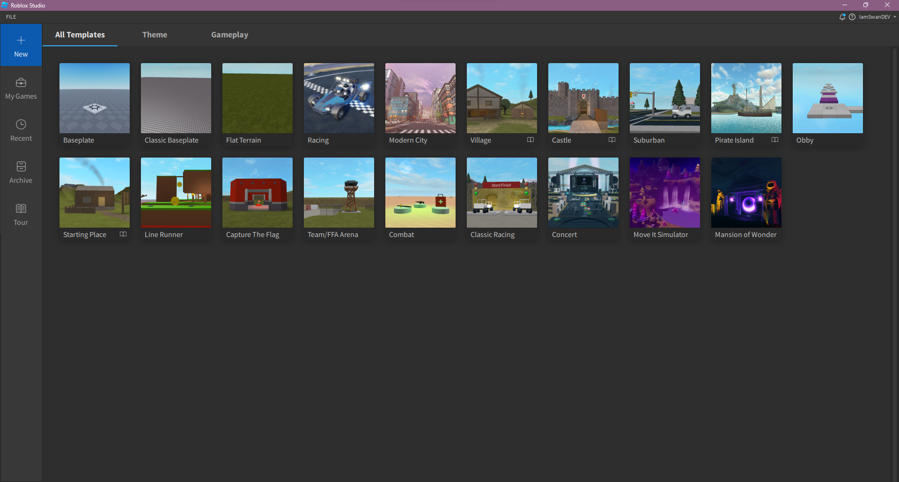

# Roblox Studio Discovery Workshop (Part 1)

## | Prerequisites |

- [Roblox Studio](https://roblox.com)

 

## | Starting |

First, create a new project (baseplate)

Once you created your project, your first step will be to save it, give it a name and make sure team create is turned on.

### New world, new buildings, learn how to place a Part!
Your first goal is to place a part in the workspace, and set its size to (3, 3, 3), and make sure it's anchored.

### New world, new rules, make your first script!
Usually, developers start with making a print("hello world") script, but if you noticed, making a new script in roblox studio just does that by default!  
Erase that line, and start making your own script!  
Your goal: making the part invisible after 10 seconds. (You can ask questions, but your most useful ressource will be the [documentation](https://create.roblox.com/docs/fr-fr/reference/engine/libraries/task#wait)!

(Important keywords: script, part, parent, transparency)

### New world!
Congratulations, you discovered all the key elements to make an inventory system! The final boss of this workshop will be to make a functionning inventory system, but, don't worry, I'm never gonna let you down!

#### What's a server, what's a client, and how to communicate???
In Roblox Studio, there are 3 important concepts to remember:
- Client Sided
    - Everything that is happening on your machine, that only you can see.
- Server Sided
    - Everything that is happening on the server, that everyone can see.

- Replicated
    - Replicated elements are elements played by every clients.

To make your inventory system, every single of these concepts will need to be understood.

In order to do so, we'll proceed by steps.

#### Replication
First of all, make a localscript in "StarterPlayerCharacter" and make it send a message to a script in "ServerScriptService" using a RemoteEvent stored in "ReplicatedStorage"

tip: to get any object in the game type : game.path.to.the.object

#### Loading projects
Now that you're somewhat familiar with the environment, load the project provided on the github of this workshop.

#### Picking items up!
As you can see in the provided file, there's a piece of wood. It will be used as a test item.

There's a script under the piece of wood.
Using proximity prompt "triggered" event (see [Proximity Prompt Documentation](https://create.roblox.com/docs/fr-fr/reference/engine/classes/ProximityPrompt)), make the script print the name of the block that has been picked up.

#### Storing the items!
Now that you notified the server you picked the item up, you got to store it!
In order to do so, you will need to create a folder, using the script called "PlayerHandler" in "ServerScriptService". Replace the comments with your code!

You're gonna need to twist the PickingUp script to make it create a "IntValue" in the inventory folder you just create.

In addition to that, if the IntValue with the block name already exist you got to make sure it increments the current Value, without adding a new IntValue!

*hint: research the :FindFirstChild() function!*

#### The UI!
Now we got to make the content of our inventory match the content of the actual folder!

Go back to the Player Handler and detect when a child is added to the inventory folder, then fire the RemoteEvent for the player.

Also make sure every child update (better indication in the code.)

Now, the UILocalScript will receive the informations that you just sent.

Complete the code to make the item appear in the Ui!

 

Congrats! you've made the hardest part! now you can pick up items and they store in the inventory! Though the system is not entirely done!

For this very last step, I want you guys to use what we discovered previously to code a dropping system!

## | Useful links |
<li> https://create.roblox.com/docs/fr-fr/reference/engine </li>
<li> https://devforum.roblox.com/ </li>
